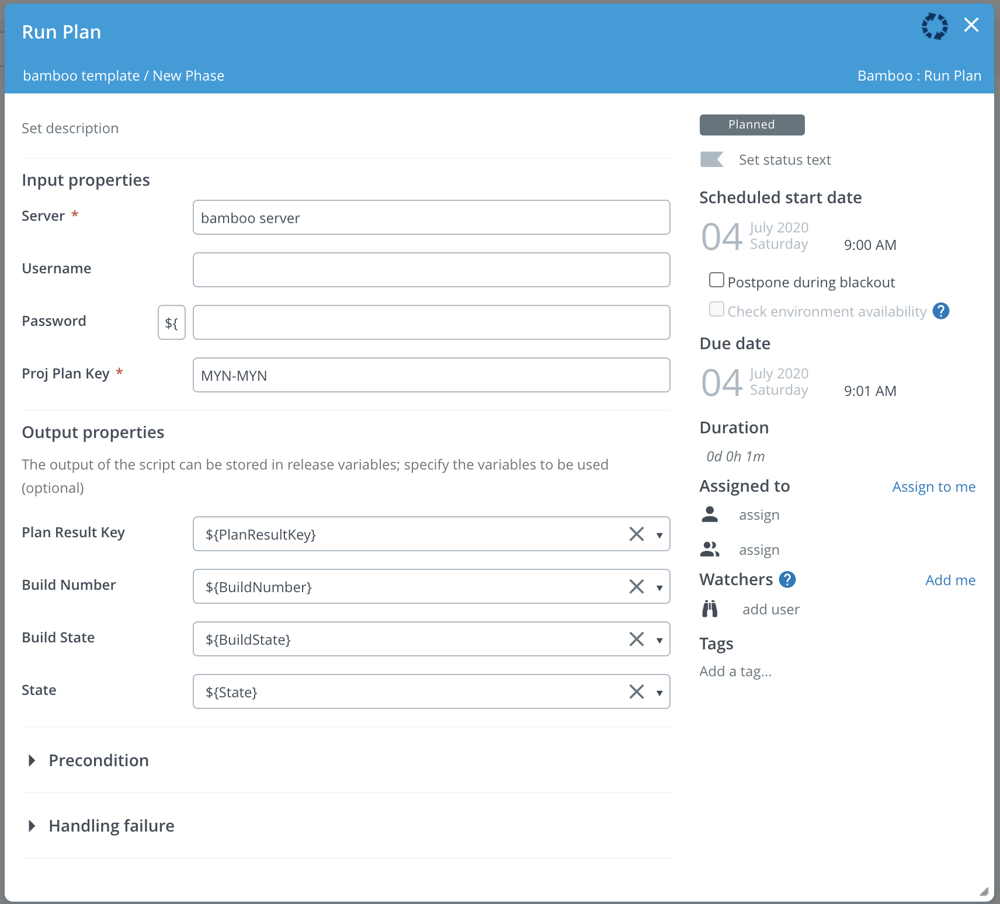
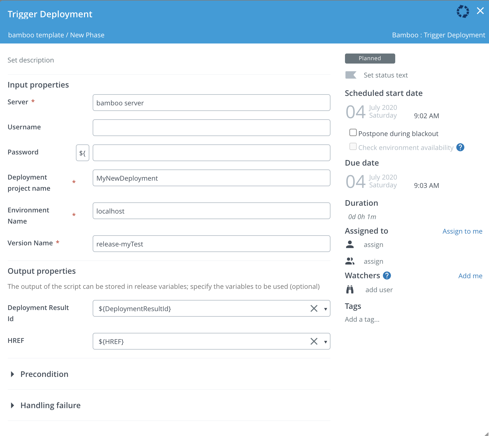
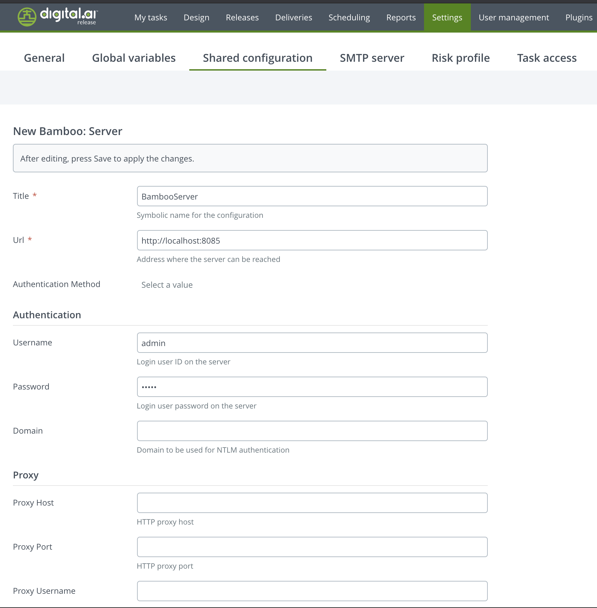
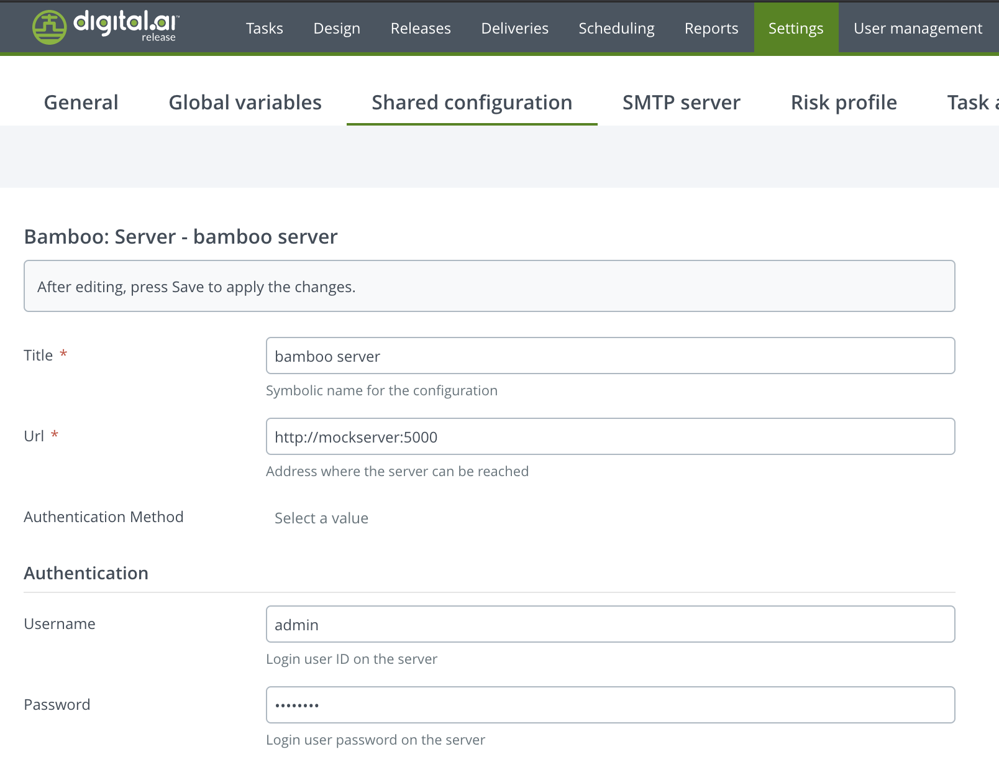

# XL Release Bamboo plugin

[![Build Status][xlr-bamboo-plugin-travis-image]][xlr-bamboo-plugin-travis-url]
[![License: MIT][xlr-bamboo-plugin-license-image]][xlr-bamboo-plugin-license-url]
![Github All Releases][xlr-bamboo-plugin-downloads-image]

[xlr-bamboo-plugin-travis-image]: https://travis-ci.org/xebialabs-community/xlr-bamboo-plugin.svg?branch=master
[xlr-bamboo-plugin-travis-url]: https://travis-ci.org/xebialabs-community/xlr-bamboo-plugin
[xlr-bamboo-plugin-license-image]: https://img.shields.io/badge/License-MIT-yellow.svg
[xlr-bamboo-plugin-license-url]: https://opensource.org/licenses/MIT
[xlr-bamboo-plugin-downloads-image]: https://img.shields.io/github/downloads/xebialabs-community/xlr-bamboo-plugin/total.svg

## Preface

This document describes the functionality provided by the XL Release Bamboo plugin.

See the [XL Release reference manual](https://docs.xebialabs.com/xl-release) for background information on XL Release and release automation concepts.

This is a 'See It Work' plugin project, meaning the code base includes functionality that makes it easy to spin up and configure a dockerized version of the XebiaLabs platform with this plugin already installed. Using the provided test data, you can then try out the plugin features. This is useful for familiarizing yourself with the plugin functionality, for demonstrations, testing and for further plugin development. [See the Demo/Dev section.](#to-run-demo-or-dev-version-set-up-docker-containers-for-both-xlr-and-the-mock-server)

The plugin code base also includes a gradle task for [automatic integration testing](#to-run-integration-tests).

## Overview

This plugin allows XL Release to run a Bamboo plan, create a Bamboo Release or trigger a Bamboo deployment.

## Requirements

* XL Release 9.0+
* This has been tested with Bamboo version 6.10.3

## Installation

* Copy the latest JAR from the [releases page](https://github.com/xebialabs-community/xlr-bamboo-plugin/releases) to your `XL-RELEASE-SERVER/plugins` directory.
* Restart your XL Release server

## Usage

### Run Plan

The Run Plan task accepts a Bamboo project-plan-key (for example, MYN-MYN).  It calls Bamboo's API to run the next build job(s) for that plan.  Polling of the job status occurs at 5-second intervals.  The script output will indicate the build status as success or failure. The Plan Result Key, Build Number, Build State and State, which are return by the Bamboo API call can be saved into Release Variables, if you choose.



### Create Release

The Create Release task take a Bamboo Deployment Project Name, a Project Build Result (which is the Plan Result Key returned after a Plan is run, such as 'MYN-MYN-9'), and a Version Name.  It calls Bamboo's API to create a release for that project.


### Trigger Deployment

The TriggerDeployment script accepts a project name, environment name, and version name.  It calls Bamboo's API to look up the respective ids of these items and then triggers a deployment.



### Configuration ###



## Developers

Build and package the plugins with...

```bash
./gradlew assemble
```

### To run integration tests

1. Clone this git project to your local dev environment
2. You will need to have Docker and Docker Compose installed.
3. The XL-Release docker image uses the community trial license
4. Open a terminal in the root of the xlr-variable-setter-plugin project and run the following gradle task 

```bash
./gradlew clean integrationTest
```

The test will set up a temporary xlr/mockserver testbed using docker. The mockserver acts as a mock Bamboo server and returns canned responses to Bamboo REST API calls. After testing is complete, the test docker containers are stopped and removed.

### To run demo or dev version (set up docker containers for both XLR and the mock server)

NOTE:

1. For requirements, see the 'To run integration tests' above.
2. XL Release will run on the [localhost port 15516](http://localhost:15516/).
3. The XL Release username / password is admin / admin.
4. The Mockserver runs on the [localhost port 5099](http://localhost:5099/).
5. The Mockserver username / password is admin / admin
6. Within XLR, you will need to set up the psuedo Bamboo server and import the provide template. When you run this XLR release, the Mockserver will act as a pseudo Bamboo server and return canned responses to Bamboo REST API calls.

* Before running the demo, be sure to create the plugin by opening a terminal, cd into the plugin source code directory, and run

```bash
./gradlew clean build
```

* To run the dev/demo mode, open a terminal, cd into the src/test/resources/docker directory of the plugin code and run

```bash
docker-compose up
```

* After XLR starts up, log in using the admin / admin credentials and set up the mock Bamboo server, as described below, and then use the XLR 'Import Template' feature to import the template found in the src/test/resources/docker/initialize/data directory. You can then create a release and run the test example.

Set up the mock Bamboo server exactly as shown with a server name of 'bamboo server' and the username/passwor admin/admin.


* To shut down and remove the docker containers, in a terminal cd to the src/test/resources/docker/initialize/data directory, and run

```bash
docker-compose down
```

## References

<https://www.atlassian.com/software/bamboo>

<https://docs.atlassian.com/atlassian-bamboo/REST/6.10.3/?_ga=2.178472611.688514311.1571778462-1591657357.1542136994/>


