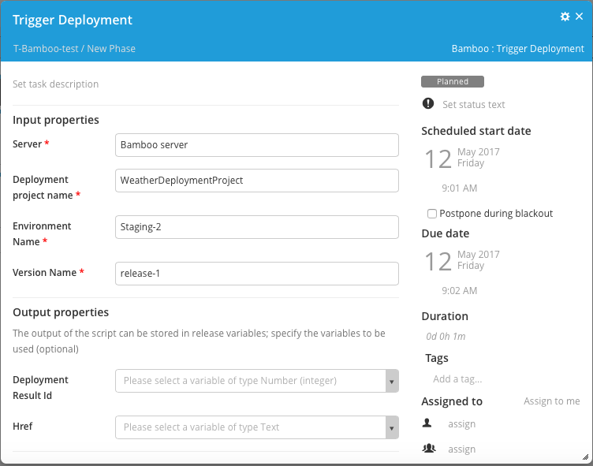
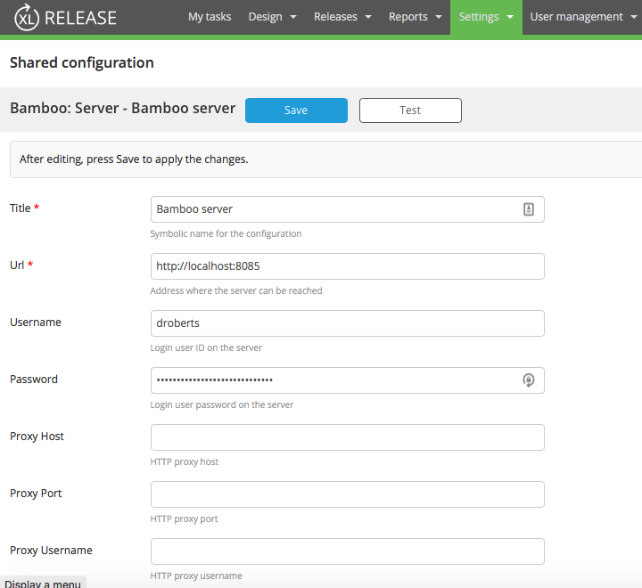

# xlr-bamboo-plugin #

### Functionality ###

* Run a Bamboo plan
* Trigger a Bamboo deployment

#### RunPlan ####

The RunPlan.py script accepts a Bamboo project-plan-key (for example, PROJ-PLAN).  It calls Bamboo's API to run the next build job(s) for that plan and the build number is returned.  Polling of the job status occurs at 5-second intervals.  The script output will indicate the build status as success or failure.

#### TriggerDeployment ####

The TriggerDeployment script accepts a project name, environment name, and version name.  It calls Bamboo's API to look up to respective ids of these items and then triggers a deployment. 

### Configuration ###

